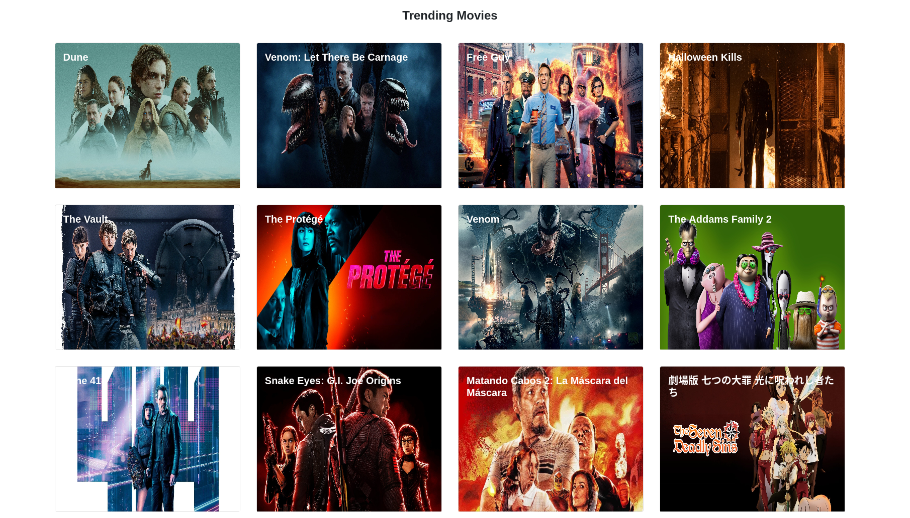
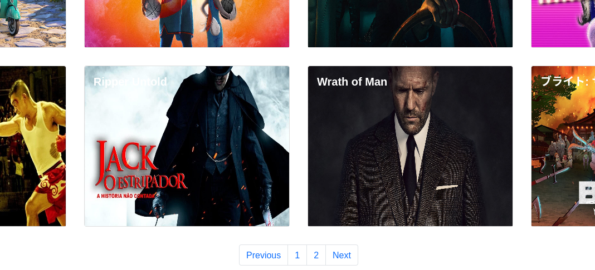
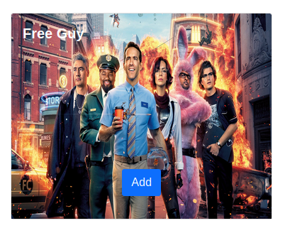
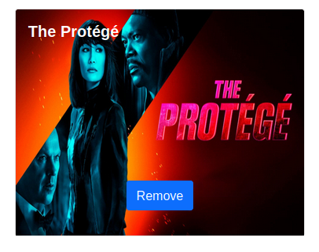
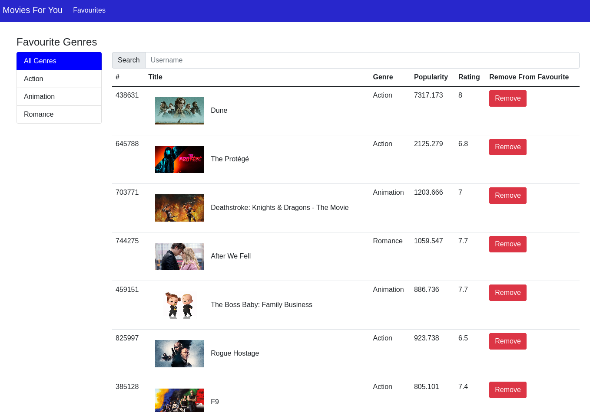

# Your Favourite Movies Application

You can use this application by following the steps:

### `npm start`

Runs the app in the development mode.\
Open [http://localhost:3000](http://localhost:3000) to view it in the browser.

### Technologies Used

### API Used to fetch movies data is tmdb movies

### Features of Application
- Home Page with Popular Movies from tmdb movies API
    
- Home Also has latest popular movies for you favourite list
    
- You can view more trending movies by moving to the next page
    
- Each Movie Card allows to add/remove movie to your favourites
    - 
    - 
- Now we can move to the favourites section from Navbar
    - This Page lists all of your favourite Movies
    - We can filter movies on basis of genre
    - Also gives our more details like rating,popularity etc
    - 

### Thank you for visiting my repo